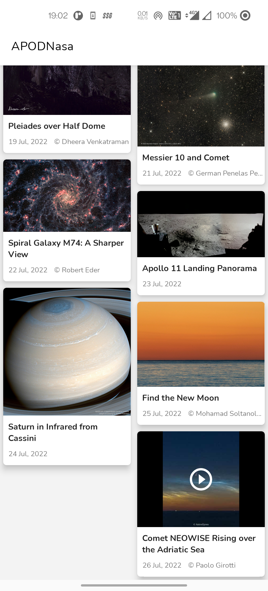

# APODNasa app

### About

App related to show [Astronomy Picture of the Day(APOD)](http://apod.nasa.gov/apod/astropix.html)
for last seven days. An app to show media listing using [APOD](https://api.nasa.gov/) api having
image/gif/video.

* Always loading Media from local database (room). Remote data (from API) and Local data is always
  synchronized.
* App can load media listing, details offline.
* Clean and Simple Material UI.
* Supporting dart-light theme.
* Daily pictures sync up in the morning

### Run a project

- Go to [https://api.nasa.gov/#signUp](https://api.nasa.gov/) and create/request new api key.
- Put generated api key in `local.properties` with property name *`API_KEY`* . Now sync project and
  run the app.
- Now navigate to [“Browse APIs”](https://api.nasa.gov/#browseAPI) → Expand APOD
  - API Base Url is [https://api.nasa.gov/planetary/apod](https://api.nasa.gov/planetary/apod)
  - Further query params to fetch in a date range are provided in the document
  - Example api call having all type of media including
    image/gif/video : https://api.nasa.gov/planetary/apod?start_date=2022-05-01&end_date=2022-05-31&thumbs=true&api_key=[your_api_key]

### Package Structure

* Root package: `com.pranay.apodnasa`
  * `data` : For data handling.
    * `local` : Classes related to manage local data using rooom database
    * `remote.api` : classes related to call remote api to get api data
    * `repository` : repository classes to manage and fetch local/remote data
  * `di` : provide hilt related dependency config classes
  * `model` : model class related response, database table etc
  * `ui` : UI related classes include default activity and fragment destination of navigation
  * `util`: Utility Classes / Kotlin extensions
  * `worker`: Created work manger worker to get scheduled api call to get APOD data and store in
    database

## 📷 Screenshots

<table style="width:100%">
  <tr>
    <th colspan="4">Dark theme</th>
  </tr>
  <tr>
    <th>Media listing</th>
    <th>Media listing with video item</th>
    <th>Media item details</th>
    <th>Video media item details</th>
  </tr>
  <tr>
    <td></td> 
    <td></td>
    <td></td> 
    <td></td> 
  </tr>
  <tr>
    <th colspan="4">Light theme</th>
  </tr>
  <tr>
    <td></td> 
    <td></td>
    <td></td> 
    <td></td> 
  </tr>
</table>

### Architecture

This app uses [***MVVM (Model View
View-Model)***](https://developer.android.com/jetpack/docs/guide#recommended-app-arch) architecture.

### Built With 🛠

- [Kotlin](https://kotlinlang.org/) : First class and official programming language for Android
  development.
- [Android Studio](https://developer.android.com/studio/index.html) : The Official IDE for Android
- [Gradle](https://gradle.org/) : Build tool for Android Studio
- [Coroutines](https://kotlinlang.org/docs/reference/coroutines-overview.html) : For asynchronous
  and more..
- [Flow](https://kotlin.github.io/kotlinx.coroutines/kotlinx-coroutines-core/kotlinx.coroutines.flow/-flow/) :
  A cold asynchronous data stream that sequentially emits values and completes normally or with an
  exception.
- [Android Architecture Components](https://developer.android.com/topic/libraries/architecture) :
  Collection of libraries that help you design robust, testable, and maintainable apps.
  - [ViewModel](https://developer.android.com/topic/libraries/architecture/viewmodel) : Stores
    UI-related data that isn't destroyed on UI changes.
  - [ViewBinding](https://developer.android.com/topic/libraries/view-binding) - Generates a binding
    class for each XML layout file present in that module and allows you to more easily write code
    that interacts with views.
  - [Navigation](https://developer.android.com/guide/navigation) : for Fragment navigation
  - [WorkManager](https://developer.android.com/topic/libraries/architecture/workmanager) : Primary
    recommended API for background processing.
  - [Room](https://developer.android.com/training/data-storage/room) : SQLite object mapping library
    to store local data
- [Material Components for Android](https://github.com/material-components/material-components-android) :
  Modular and customizable Material Design UI components for Android.
- [Dependency Injection](https://developer.android.com/training/dependency-injection) :
  - [Hilt-Dagger](https://dagger.dev/hilt/) : Standard library to incorporate Dagger dependency
    injection into an Android application.
  - [Hilt-ViewModel](https://developer.android.com/training/dependency-injection/hilt-jetpack) : DI
    for injecting `ViewModel`.
- [Retrofit](https://square.github.io/retrofit/) : A type-safe HTTP client for Android and Java.
  Using for network api call.
- [Gson Converter](https://github.com/square/retrofit/tree/master/retrofit-converters/gson) : A
  Converter which uses Gson for serialization to and from JSON.
- [Glide](https://github.com/bumptech/glide) - open source media management and image loading
  framework for Android
- [sdp](https://github.com/intuit/sdp) and [ssp](https://github.com/intuit/ssp) : Provide common
  dimens sizes to support different screen wise size

### Other points

- Using [`navGraphViewModels`](https://developer.android.com/guide/navigation/navigation-programmatic#share_ui-related_data_between_destinations_with_viewmodel)
extension for ViewModel that provide maintain data across given navigation graph to completed
selling produce and show selling produce info on next page.
- Using [Navigation Animation](https://developer.android.com/guide/navigation/navigation-animate-transitions)
for screen navigation

### App color theming 
- Clone color theming from [Foodium](https://github.com/PatilShreyas/Foodium) app

### :envelope: Get in touch!

* [@Twitter](https://twitter.com/pranatpatel_)

### Find this project useful ? ❤️

Support it by clicking the ⭐️ button on the upper right of this page. ✌️

### License

See [License](https://github.com/pranaypatel512/APODNasa/blob/master/LICENSE)
